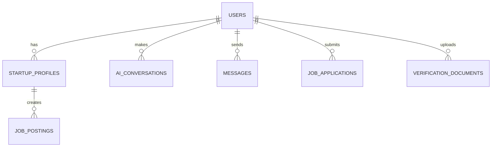

# KAPITAL Developer Guide

This guide provides comprehensive information for developers who want to contribute to, customize, or understand the KAPITAL startup ecosystem platform codebase.

## 📋 Table of Contents

1. [Development Environment Setup](#development-environment-setup)
2. [Architecture Overview](#architecture-overview)
3. [Codebase Structure](#codebase-structure)
4. [Database Schema](#database-schema)
5. [API Documentation](#api-documentation)
6. [AI Integration](#ai-integration)
7. [Authentication System](#authentication-system)
8. [File Management](#file-management)
9. [Security Guidelines](#security-guidelines)
10. [Testing & Debugging](#testing--debugging)
11. [Deployment](#deployment)
12. [Contributing](#contributing)

## 🛠️ Development Environment Setup

### Prerequisites
```bash
# Required software
- PHP 7.4+ (8.0+ recommended)
- MySQL 8.0+ or MariaDB 10.4+
- Apache 2.4+ or Nginx
- Composer (for dependency management)
- Git
- Node.js (for frontend assets, if applicable)
```

### Local Development Setup

#### 1. Clone and Setup
```bash
git clone https://github.com/jessyforg/KAPITALcapstone.git
cd KAPITALcapstone
cd "public_html (1)"
composer install
```

#### 2. Environment Configuration
```php
// config.php - Development settings
define('ENVIRONMENT', 'development');
define('DEBUG_MODE', true);
define('DB_HOST', 'localhost');
define('DB_USER', 'root');
define('DB_PASS', '');
define('DB_NAME', 'kapitalcapstone');
```

#### 3. Database Setup
```sql
-- Create development database
CREATE DATABASE kapitalcapstone CHARACTER SET utf8mb4 COLLATE utf8mb4_unicode_ci;

-- Import schema
mysql -u root -p kapitalcapstone < setup_localhost_complete.sql
```

#### 4. Directory Permissions
```bash
# Set proper permissions for upload directories
chmod 755 uploads/
chmod 755 logs/
chmod 666 logs/*.log
```

## 🏗️ Architecture Overview

### System Architecture

```
KAPITAL Platform Architecture

┌─────────────────────────────────────────────────────────────┐
│                     Presentation Layer                      │
├─────────────────────────────────────────────────────────────┤
│  HTML/CSS/JavaScript  │  PHP Views  │  AJAX Components     │
├─────────────────────────────────────────────────────────────┤
│                     Application Layer                       │
├─────────────────────────────────────────────────────────────┤
│  Controllers  │  Services  │  AI Integration  │  Utilities  │
├─────────────────────────────────────────────────────────────┤
│                       Data Layer                           │
├─────────────────────────────────────────────────────────────┤
│     MySQL Database    │    File System    │   Caching     │
└─────────────────────────────────────────────────────────────┘

External Services:
├── OpenAI API (GPT-4)
├── Email Services (SMTP)
└── File Storage Systems
```

### Technology Stack

#### Backend
- **Language**: PHP 7.4+
- **Database**: MySQL 8.0+
- **Session Management**: PHP Sessions
- **File Handling**: Native PHP file functions
- **API Integration**: cURL for external APIs

#### Frontend
- **Markup**: HTML5
- **Styling**: CSS3 with custom framework
- **Scripting**: Vanilla JavaScript
- **AJAX**: XMLHttpRequest/Fetch API
- **UI Components**: Custom components

#### External Services
- **AI Provider**: OpenAI GPT-4
- **Dependencies**: Composer packages
- **Logging**: Custom logging system

## 📁 Codebase Structure

### Directory Organization

```
public_html (1)/
├── admin/                    # Admin panel functionality
│   ├── admin_navbar.php     # Admin navigation
│   ├── process_ticket.php   # Support ticket processing
│   └── tickets.php          # Ticket management
├── imgs/                    # Static images and assets
│   ├── assets/              # Logo and branding
│   ├── gallery/             # Platform gallery
│   └── TBIs/                # Partner organization logos
├── logs/                    # Application logs
├── uploads/                 # User uploaded files
│   ├── files/               # General documents
│   ├── logos/               # Company logos
│   ├── messages/            # Message attachments
│   ├── profile_pictures/    # User avatars
│   ├── resumes/             # Resume files
│   └── verification_documents/ # ID verification
├── vendor/                  # Composer dependencies
├── sql/                     # Database schemas and updates
├── core/                    # Core application files
│   ├── config.php           # Configuration settings
│   ├── db_connection.php    # Database connection
│   ├── functions.php        # Utility functions
│   └── session_manager.php  # Session handling
├── services/                # Business logic services
│   ├── ai_service.php       # AI integration service
│   ├── user_service.php     # User management
│   ├── message_service.php  # Messaging system
│   └── file_service.php     # File management
├── views/                   # Page templates and views
└── api/                     # API endpoints (if applicable)
```

### Key Files and Their Purposes

#### Core Configuration
```php
// config.php - Main configuration
define('DB_HOST', 'localhost');
define('DB_USER', 'root');
define('DB_PASS', '');
define('DB_NAME', 'kapitalcapstone');
define('AI_API_KEY', 'your-openai-api-key');
define('AI_MODEL', 'gpt-4');
```

#### Database Connection
```php
// db_connection.php - Database connectivity
function get_db_connection() {
    $host = DB_HOST;
    $user = DB_USER;
    $pass = DB_PASS;
    $name = DB_NAME;
    
    $conn = new mysqli($host, $user, $pass, $name);
    if ($conn->connect_error) {
        die("Connection failed: " . $conn->connect_error);
    }
    return $conn;
}
```

#### Session Management
```php
// session_manager.php - User session handling
function start_secure_session() {
    if (session_status() == PHP_SESSION_NONE) {
        session_start();
    }
}

function is_logged_in() {
    return isset($_SESSION['user_id']) && !empty($_SESSION['user_id']);
}
```

## 🗄️ Database Schema

### Core Tables

#### Users Table
```sql
CREATE TABLE `users` (
  `user_id` int(11) NOT NULL AUTO_INCREMENT,
  `name` varchar(255) NOT NULL,
  `email` varchar(255) NOT NULL UNIQUE,
  `password` varchar(255) NOT NULL,
  `role` enum('entrepreneur','investor','job_seeker','admin') NOT NULL,
  `verification_status` enum('pending','verified','not approved') DEFAULT 'pending',
  `created_at` timestamp NOT NULL DEFAULT CURRENT_TIMESTAMP,
  `updated_at` timestamp NOT NULL DEFAULT CURRENT_TIMESTAMP ON UPDATE CURRENT_TIMESTAMP,
  `profile_picture_url` varchar(255) DEFAULT NULL,
  `location` varchar(255) DEFAULT NULL,
  `introduction` text DEFAULT NULL,
  `accomplishments` text DEFAULT NULL,
  `contact_number` varchar(20) DEFAULT NULL,
  `public_email` varchar(255) DEFAULT NULL,
  `industry` varchar(255) DEFAULT NULL,
  PRIMARY KEY (`user_id`)
);
```

#### Startup Profiles
```sql
CREATE TABLE `startup_profiles` (
  `startup_profile_id` int(11) NOT NULL AUTO_INCREMENT,
  `user_id` int(11) NOT NULL,
  `startup_name` varchar(255) NOT NULL,
  `founding_date` date DEFAULT NULL,
  `team_size` int(11) DEFAULT NULL,
  `funding_stage` varchar(50) DEFAULT NULL,
  `pitch_deck_url` varchar(255) DEFAULT NULL,
  `business_plan_url` varchar(255) DEFAULT NULL,
  `website_url` varchar(255) DEFAULT NULL,
  `development_stage` varchar(50) DEFAULT NULL,
  `created_at` timestamp NOT NULL DEFAULT CURRENT_TIMESTAMP,
  `updated_at` timestamp NOT NULL DEFAULT CURRENT_TIMESTAMP ON UPDATE CURRENT_TIMESTAMP,
  PRIMARY KEY (`startup_profile_id`),
  FOREIGN KEY (`user_id`) REFERENCES `users`(`user_id`) ON DELETE CASCADE
);
```

#### AI Conversations
```sql
CREATE TABLE `AI_Conversations` (
  `conversation_id` int(11) NOT NULL AUTO_INCREMENT,
  `user_id` int(11) NOT NULL,
  `question` text NOT NULL,
  `response` text DEFAULT NULL,
  `created_at` datetime NOT NULL DEFAULT CURRENT_TIMESTAMP,
  `responded_at` datetime DEFAULT NULL,
  PRIMARY KEY (`conversation_id`),
  KEY `user_id` (`user_id`),
  FOREIGN KEY (`user_id`) REFERENCES `users`(`user_id`) ON DELETE CASCADE
);
```

### Database Relationships



## 🔌 API Documentation

### Internal API Endpoints

#### User Authentication
```php
// signin_process.php
POST /signin_process.php
Content-Type: application/x-www-form-urlencoded

Parameters:
- email: string (required)
- password: string (required)

Response:
- Success: Redirect to dashboard
- Error: JSON error message
```

#### AI Service
```php
// ai_service.php
POST /startup_ai_advisor.php
Content-Type: application/x-www-form-urlencoded

Parameters:
- question: string (required)
- user_id: int (from session)

Response:
JSON {
  "success": boolean,
  "response": string,
  "tokens_used": int
}
```

#### File Upload
```php
// File upload endpoints
POST /upload_file.php
Content-Type: multipart/form-data

Parameters:
- file: File (required)
- type: string (profile_picture|resume|business_plan|etc.)

Response:
JSON {
  "success": boolean,
  "file_url": string,
  "message": string
}
```

### External API Integration

#### OpenAI Integration
```php
// ai_service.php - OpenAI API call
class AIService {
    private function callOpenAI($question) {
        $ch = curl_init();
        
        $data = [
            'model' => $this->model,
            'messages' => [
                ['role' => 'system', 'content' => $this->getSystemPrompt()],
                ['role' => 'user', 'content' => $question]
            ],
            'temperature' => 0.7,
            'max_tokens' => 1000
        ];
        
        curl_setopt_array($ch, [
            CURLOPT_URL => $this->api_url,
            CURLOPT_RETURNTRANSFER => true,
            CURLOPT_POST => true,
            CURLOPT_POSTFIELDS => json_encode($data),
            CURLOPT_HTTPHEADER => [
                'Content-Type: application/json',
                'Authorization: Bearer ' . $this->api_key
            ]
        ]);
        
        $response = curl_exec($ch);
        curl_close($ch);
        
        return $this->parseOpenAIResponse($response);
    }
}
```

## 🤖 AI Integration

### AI Service Architecture

#### AIService Class
```php
class AIService {
    private $conn;
    private $token_tracker;
    private $api_key;
    private $model;
    private $cache_duration = 3600;
    
    public function __construct($conn) {
        $this->conn = $conn;
        $this->token_tracker = new TokenTracker($conn);
        $this->api_key = AI_API_KEY;
        $this->model = AI_MODEL;
    }
    
    public function getBusinessAdvice($user_id, $question) {
        // Implementation details...
    }
}
```

#### Token Management
```php
class TokenTracker {
    private $conn;
    private $daily_limit = 10000; // tokens per day
    
    public function checkUserTokenLimit($user_id) {
        $today = date('Y-m-d');
        $stmt = $this->conn->prepare("
            SELECT SUM(tokens_used) as total_tokens 
            FROM Token_Usage 
            WHERE user_id = ? AND date = ?
        ");
        $stmt->bind_param("is", $user_id, $today);
        $stmt->execute();
        $result = $stmt->get_result()->fetch_assoc();
        
        return ($result['total_tokens'] ?? 0) < $this->daily_limit;
    }
}
```

### AI Features Implementation

#### Business Advisor
- **System Prompt**: Specialized prompts for startup advice
- **Context Awareness**: Maintains conversation context
- **Response Caching**: Reduces API calls for similar questions
- **Token Optimization**: Efficient token usage strategies

#### Resume Enhancement
- **Text Analysis**: Extracts and analyzes resume content
- **Enhancement Algorithms**: AI-powered content improvement
- **Keyword Optimization**: Industry-specific keyword insertion
- **Format Suggestions**: Professional formatting recommendations

## 🔐 Authentication System

### Session Management

#### User Authentication Flow
```php
// signin_process.php
if ($_POST['email'] && $_POST['password']) {
    $email = sanitize_input($_POST['email']);
    $password = $_POST['password'];
    
    $stmt = $conn->prepare("SELECT user_id, password FROM users WHERE email = ?");
    $stmt->bind_param("s", $email);
    $stmt->execute();
    $result = $stmt->get_result();
    
    if ($user = $result->fetch_assoc()) {
        if (password_verify($password, $user['password'])) {
            $_SESSION['user_id'] = $user['user_id'];
            $_SESSION['email'] = $email;
            // Redirect to dashboard
        }
    }
}
```

#### Password Security
```php
// Registration password hashing
$hashed_password = password_hash($password, PASSWORD_DEFAULT);

// Login verification
if (password_verify($input_password, $stored_hash)) {
    // Login successful
}
```

#### Session Security
```php
// session_manager.php
function start_secure_session() {
    // Configure secure session settings
    ini_set('session.cookie_httponly', 1);
    ini_set('session.cookie_secure', 1);
    ini_set('session.use_only_cookies', 1);
    
    session_start();
    
    // Regenerate session ID on login
    if (isset($_SESSION['user_id'])) {
        session_regenerate_id(true);
    }
}
```

### Authorization Levels

#### Role-Based Access Control
```php
function check_user_role($required_role) {
    if (!is_logged_in()) {
        redirect_to_login();
        return false;
    }
    
    $user_role = get_user_role($_SESSION['user_id']);
    $role_hierarchy = [
        'admin' => 4,
        'entrepreneur' => 3,
        'investor' => 2,
        'job_seeker' => 1
    ];
    
    return $role_hierarchy[$user_role] >= $role_hierarchy[$required_role];
}
```

## 📁 File Management

### Upload System

#### File Upload Handler
```php
// file_upload.php
class FileUploader {
    private $allowed_types = ['pdf', 'doc', 'docx', 'jpg', 'png'];
    private $max_size = 50 * 1024 * 1024; // 50MB
    
    public function upload($file, $type, $user_id) {
        // Validate file
        if (!$this->validateFile($file)) {
            throw new Exception("Invalid file");
        }
        
        // Generate secure filename
        $filename = $this->generateSecureFilename($file['name']);
        
        // Determine upload directory
        $upload_dir = $this->getUploadDirectory($type);
        
        // Move file
        if (move_uploaded_file($file['tmp_name'], $upload_dir . $filename)) {
            // Log upload
            $this->logFileUpload($user_id, $filename, $type);
            return $upload_dir . $filename;
        }
        
        throw new Exception("Upload failed");
    }
}
```

#### Security Measures
```php
// File validation
private function validateFile($file) {
    // Check file size
    if ($file['size'] > $this->max_size) {
        return false;
    }
    
    // Check file type
    $extension = strtolower(pathinfo($file['name'], PATHINFO_EXTENSION));
    if (!in_array($extension, $this->allowed_types)) {
        return false;
    }
    
    // Check MIME type
    $finfo = finfo_open(FILEINFO_MIME_TYPE);
    $mime_type = finfo_file($finfo, $file['tmp_name']);
    finfo_close($finfo);
    
    $allowed_mimes = [
        'application/pdf',
        'application/msword',
        'image/jpeg',
        'image/png'
    ];
    
    return in_array($mime_type, $allowed_mimes);
}
```

### Directory Structure
```
uploads/
├── files/              # General documents
├── logos/              # Company logos
├── messages/           # Message attachments
├── profile_pictures/   # User avatars
├── resumes/           # Resume files
│   └── temp/          # Temporary processing
└── verification_documents/ # ID verification
```

## 🔒 Security Guidelines

### Input Validation
```php
// Input sanitization
function sanitize_input($data) {
    $data = trim($data);
    $data = stripslashes($data);
    $data = htmlspecialchars($data);
    return $data;
}

// SQL injection prevention
$stmt = $conn->prepare("SELECT * FROM users WHERE email = ?");
$stmt->bind_param("s", $email);
$stmt->execute();
```

### XSS Prevention
```php
// Output escaping
function escape_output($data) {
    return htmlspecialchars($data, ENT_QUOTES, 'UTF-8');
}

// In HTML templates
echo escape_output($user_input);
```

### CSRF Protection
```php
// Generate CSRF token
function generate_csrf_token() {
    if (empty($_SESSION['csrf_token'])) {
        $_SESSION['csrf_token'] = bin2hex(random_bytes(32));
    }
    return $_SESSION['csrf_token'];
}

// Verify CSRF token
function verify_csrf_token($token) {
    return isset($_SESSION['csrf_token']) && 
           hash_equals($_SESSION['csrf_token'], $token);
}
```

### File Security
```apache
# .htaccess for upload directories
Options -Indexes
<Files "*.php">
    Order Deny,Allow
    Deny from all
</Files>
```

## 🧪 Testing & Debugging

### Error Logging
```php
// Custom logging system
function custom_log($message, $level = 'INFO') {
    $timestamp = date('Y-m-d H:i:s');
    $log_entry = "[$timestamp] [$level] $message" . PHP_EOL;
    
    $log_file = 'logs/app_' . date('Y-m-d') . '.log';
    file_put_contents($log_file, $log_entry, FILE_APPEND | LOCK_EX);
}

// Usage
custom_log("User login attempt: " . $email, "INFO");
custom_log("Database connection failed", "ERROR");
```

### Debug Mode
```php
// config.php - Development settings
if (ENVIRONMENT === 'development') {
    error_reporting(E_ALL);
    ini_set('display_errors', 1);
    ini_set('log_errors', 1);
} else {
    error_reporting(0);
    ini_set('display_errors', 0);
}
```

### Testing Utilities
```php
// test_localhost_setup.php - System diagnostics
function test_database_connection() {
    try {
        $conn = get_db_connection();
        return "✅ Database connection successful";
    } catch (Exception $e) {
        return "❌ Database connection failed: " . $e->getMessage();
    }
}

function test_ai_service() {
    try {
        $ai = new AIService($conn);
        $response = $ai->getBusinessAdvice(1, "Test question");
        return "✅ AI service working";
    } catch (Exception $e) {
        return "❌ AI service failed: " . $e->getMessage();
    }
}
```

## 🚀 Deployment

### Production Checklist

#### Pre-Deployment
- [ ] Update configuration for production
- [ ] Set debug mode to false
- [ ] Configure SSL certificates
- [ ] Set up proper file permissions
- [ ] Configure email settings
- [ ] Update API keys
- [ ] Database optimization

#### Security Configuration
```php
// config.php - Production settings
define('ENVIRONMENT', 'production');
define('DEBUG_MODE', false);
define('DB_HOST', 'your-production-host');
define('FORCE_SSL', true);
define('SESSION_SECURE', true);
```

#### Performance Optimization
```php
// Enable OPcache
opcache.enable=1
opcache.memory_consumption=256
opcache.interned_strings_buffer=8
opcache.max_accelerated_files=4000
opcache.revalidate_freq=60
opcache.fast_shutdown=1
```

### Deployment Process

#### 1. File Transfer
```bash
# Upload files via FTP/SFTP
rsync -av --exclude 'logs/' --exclude '.git/' \
    public_html/ user@server:/var/www/html/
```

#### 2. Database Migration
```sql
-- Run production database setup
mysql -u username -p database_name < production_schema.sql

-- Update configuration tables
UPDATE system_config SET value = 'production' WHERE key = 'environment';
```

#### 3. Post-Deployment Verification
```bash
# Check file permissions
find /var/www/html -type f -exec chmod 644 {} \;
find /var/www/html -type d -exec chmod 755 {} \;
chmod 666 /var/www/html/logs/*.log

# Test critical functions
curl -f http://yourdomain.com/test_production.php
```

## 🤝 Contributing

### Development Workflow

#### 1. Setup Development Environment
```bash
git clone https://github.com/jessyforg/KAPITALcapstone.git
cd KAPITALcapstone
composer install
# Setup database and configuration
```

#### 2. Create Feature Branch
```bash
git checkout -b feature/your-feature-name
```

#### 3. Make Changes
- Follow coding standards
- Add appropriate comments
- Update documentation
- Test functionality

#### 4. Submit Pull Request
- Describe changes clearly
- Include testing instructions
- Reference related issues

### Coding Standards

#### PHP Standards
```php
// Use PSR-12 coding standards
class UserService {
    private $conn;
    
    public function __construct($connection) {
        $this->conn = $connection;
    }
    
    public function getUserById($userId) {
        // Method implementation
    }
}
```

#### Documentation Standards
```php
/**
 * Retrieves user information by ID
 *
 * @param int $userId The unique user identifier
 * @return array|null User data or null if not found
 * @throws DatabaseException When database error occurs
 */
public function getUserById($userId) {
    // Implementation
}
```

### Issue Reporting

#### Bug Reports
Include:
- Steps to reproduce
- Expected behavior
- Actual behavior
- Environment details
- Error messages/logs

#### Feature Requests
Include:
- Problem description
- Proposed solution
- Use cases
- Implementation suggestions

---

## 📞 Support for Developers

- **Documentation**: Check all .md files in repository
- **Issues**: GitHub Issues for bug reports
- **Discussions**: GitHub Discussions for questions
- **Code Review**: Pull request reviews

**Happy coding! Help us build the future of the Cordillera startup ecosystem.** 